# Diagrama entidad–relación del Módulo 2

**Fecha**: 2026-10-02
**Fuente**: [plan-arquitectura.md § Base de datos](./plan-arquitectura.md#base-de-datos)

Este documento solo dibuja el modelo de datos ya definido en el plan de arquitectura. No agrega tablas ni columnas: si algo falta aquí, falta allá.

## Alcance

El Módulo 2 es dueño de los usuarios, las reservas (estudiantiles y académicas), los préstamos, los reportes de cumplimiento que recibe y las tablas de mensajería. **No** guarda el recurso ni su estado operativo, que son del Módulo 1, ni las sanciones, que son del Módulo 3. Por eso `resource_id` aparece como un `varchar` sin tabla propia: es una referencia a una entidad externa, y en el diagrama se dibuja como `resource_module1` con borde conceptual, no como una tabla de nuestro esquema.

## Diagrama

```mermaid
erDiagram
    app_user {
        uuid        id                      PK
        varchar     code                    UK  "codigo estudiantil o institucional"
        varchar     name
        varchar     email                   UK  "dominio institucional"
        varchar     password_hash               "BCrypt"
        varchar     role                        "ESTUDIANTE | MONITOR | DIRECCION_PROGRAMA"
        boolean     active
        timestamptz created_at
    }

    reservation {
        uuid        id                      PK
        uuid        user_id                 FK  "nulo solo si origen = ACADEMICO"
        varchar     resource_id                 "identificador del Modulo 1"
        varchar     resource_category           "ESPACIO | ACTIVO"
        varchar     origin                      "ESTUDIANTIL | ACADEMICO"
        varchar     status                      "CONFIRMADA | CANCELADA | CANCELADA_POR_PRIORIDAD_ACADEMICA | CANCELADA_POR_RECURSO_NO_DISPONIBLE | FINALIZADA"
        timestamptz starts_at                   "inicio de la franja, o entrega del prestamo"
        timestamptz ends_at                     "fin de la franja, o vencimiento del prestamo"
        tstzrange   occupancy                   "generada: tstzrange(starts_at, ends_at, [)"
        varchar     cancellation_reason         "nulo"
        timestamptz cancelled_at                "nulo"
        timestamptz created_at
        bigint      version                     "bloqueo optimista"
    }

    loan {
        uuid        reservation_id          PK  "tambien FK"
        int         term_business_days          "segun el tipo del activo (Modulo 1)"
        timestamptz picked_up_at                "nulo: cuando se recogio"
        boolean     renewed                     "una sola renovacion (UC2 FR-016)"
        timestamptz returned_at                 "nulo: llega por check-out (UC12)"
    }

    academic_block {
        uuid        reservation_id          PK  "tambien FK"
        uuid        semester_schedule_id    FK  "nulo si es necesidad extraordinaria"
        varchar     type                        "REGULAR | EXTRAORDINARIO"
        varchar     course
        varchar     program
        varchar     instructor
    }

    semester_schedule {
        uuid        id                      PK
        varchar     academic_term               "p. ej. 2026-2"
        uuid        uploaded_by             FK  "app_user de Direccion de Programa"
        timestamptz uploaded_at
        jsonb       result                      "resumen de la carga: creados, choques, rechazos"
    }

    absence {
        uuid        id                      PK
        uuid        reservation_id          FK  "unico"
        timestamptz reported_at                 "cuando llego el aviso del Modulo 3"
        boolean     voided                      "anulacion de un reporte enviado por error"
    }

    check_out {
        uuid        id                      PK
        uuid        reservation_id          FK  "unico"
        timestamptz occurred_at                 "devolucion o revision real"
        varchar     verdict                     "nulo; solo espacios: NO_ISSUES | NEEDS_MAINTENANCE"
        timestamptz received_at
    }

    denial {
        uuid        id                      PK
        uuid        user_id                 FK
        varchar     resource_id                 "identificador del Modulo 1"
        varchar     code                        "del diccionario de errores"
        timestamptz occurred_at
    }

    outbox_message {
        uuid        id                      PK  "tambien es el eventId publicado"
        varchar     type                        "RESERVATION_RECORD | CANCELLATION; determina el topic"
        uuid        reservation_id          FK  "clave de particion en Kafka"
        jsonb       payload                     "el evento serializado"
        varchar     status                      "PENDING | SENT | FAILED"
        int         attempts
        timestamptz next_attempt_at             "espera creciente tras un fallo"
        varchar     last_error                  "nulo; para diagnosticar los FAILED"
        timestamptz created_at
        timestamptz sent_at
    }

    inbox_message {
        uuid        event_id                PK  "el eventId del Modulo 3; la PK descarta el repetido"
        varchar     topic                       "de que topic llego"
        varchar     type                        "NO_SHOW | CHECK_OUT"
        uuid        reservation_id          FK  "nulo si la reserva no existe"
        jsonb       payload                     "el evento tal como llego"
        timestamptz processed_at
    }

    resource_module1 {
        varchar     id                      PK  "NO es tabla nuestra: vive en el Modulo 1"
        varchar     category                    "ESPACIO | ACTIVO"
        varchar     operational_status          "DISPONIBLE | EN_USO | EN_MANTENIMIENTO"
    }

    app_user            |o--o{ reservation           : "es titular de"
    app_user            ||--o{ denial        : "acumula"
    app_user            ||--o{ semester_schedule : "carga"

    reservation            ||--o| loan          : "detalla si es ACTIVO"
    reservation            ||--o| academic_block : "detalla si es ACADEMICO"
    reservation            ||--o| absence          : "recibe (UC9)"
    reservation            ||--o| check_out         : "recibe (UC12)"
    reservation            ||--o{ outbox_message  : "origina (UC10, UC11)"
    reservation            |o--o{ inbox_message  : "referida por"

    semester_schedule  ||--o{ academic_block : "genera"

    resource_module1    ||--o{ reservation           : "se reserva (por resource_id, sin FK)"
    resource_module1    ||--o{ denial        : "se deniega (por resource_id, sin FK)"
```



## Cómo leer las relaciones

| Relación | Cardinalidad | Por qué |
|---|---|---|
| `app_user` → `reservation` | 0..1 a 0..* | La reserva académica no tiene titular: `user_id` es nulo cuando `origen = 'ACADEMICO'`, y la restricción `reservation_holder_by_origin` lo obliga en los dos sentidos. |
| `reservation` → `loan` | 1 a 0..1 | Solo las reservas de activos tienen préstamo. La PK de `loan` es la propia `reservation_id`, así que no puede haber dos. |
| `reservation` → `academic_block` | 1 a 0..1 | Solo las de origen `ACADEMICO`. Mismo patrón: PK compartida con `reservation`. |
| `semester_schedule` → `academic_block` | 1 a 0..* | Una carga semestral genera muchos bloqueos; un bloqueo extraordinario no viene de ninguna carga, de ahí que `semester_schedule_id` admita nulo. |
| `reservation` → `absence` / `check_out` | 1 a 0..1 | El `reservation_id` es único en las dos tablas: un solo reporte por reserva. |
| `reservation` → `outbox_message` | 1 a 0..* | Una reserva produce la ficha (UC10) y, si se cancela, el reporte de cancelación (UC11). |
| `reservation` → `inbox_message` | 0..1 a 0..* | Varios eventos del Módulo 3 pueden referirse a la misma reserva, y `reservation_id` queda nulo si el evento se rechazó porque la reserva no existe. |
| `resource_module1` → `reservation` / `denial` | conceptual | No hay clave foránea: el recurso vive en el Módulo 1 y nosotros guardamos solo su `resource_id` y su categoría. La integridad se valida contra el `InventoryPort`, no contra la base. |

## Restricciones que el diagrama no puede dibujar

```sql
CREATE EXTENSION IF NOT EXISTS btree_gist;

ALTER TABLE reservation ADD CONSTRAINT reservation_no_overlap
  EXCLUDE USING gist (resource_id WITH =, occupancy WITH &&)
  WHERE (status = 'CONFIRMADA');

ALTER TABLE reservation ADD CONSTRAINT reservation_holder_by_origin
  CHECK ((origin = 'ACADEMICO') = (user_id IS NULL));
```

```sql
CREATE INDEX outbox_message_pending
  ON outbox_message (next_attempt_at, created_at)
  WHERE (status = 'PENDING');
```

- **`reservation_no_overlap`** es la regla central del modelo: la base impide que dos reservas confirmadas del mismo recurso se solapen, sin importar si son franjas de espacio, préstamos de varios días, reservas estudiantiles o bloqueos académicos. Es la razón por la que todo vive en una sola tabla `reservation` con una columna `occupancy` de tipo rango.
- **`reservation_holder_by_origin`** es la que hace coherente la cardinalidad 0..1 entre `app_user` y `reservation`.
- Los parámetros del negocio (cupo de 3, ventana de 06:00 a 22:00, 10 minutos de no-show, 2 horas por franja) **no son tablas**: van en `application.properties`.

## Pendientes que tocan el modelo

Los mismos del plan de arquitectura, acotados a lo que cambiaría este diagrama:

| Pendiente | Qué tabla afectaría |
|---|---|
| UC7 | Falta la tabla de historial de cambios de estado (`StatusChange`); se diseña cuando se responda P-20. |
| UC9 | En qué estado queda una reserva con ausencia: la lista de `reservation.status` no tiene uno propio. |
| P-08 | Un préstamo que nunca se devuelve: hoy `reservation.ends_at` y la ocupación duran hasta el check-out. |
| Registro | El spec de registro e inicio de sesión puede añadir columnas a `app_user` (dominio de correo permitido, datos obligatorios). |
